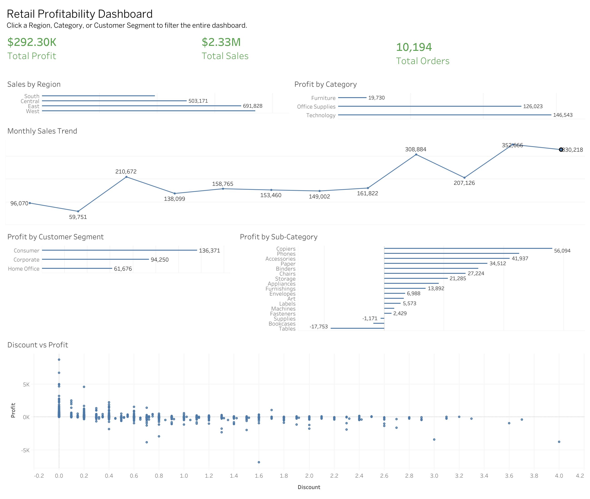

# Retail Sales & Profitability Executive Dashboard

An interactive Tableau dashboard that analyzes retail sales performance, profitability, customer segments, product categories, and discounting strategy using Tableau's Sample Superstore dataset.

🔗 **Interactive Dashboard:** [Retail Profitability Dashboard](https://public.tableau.com/app/profile/aahana.joseph5823/viz/Retail_Profitability_Dashboard/Dashboard?publish=yes)

---

## Project Overview

Retail organizations generate large volumes of transactional data every day, but understanding what drives profitability requires more than tracking sales alone.

This project presents an executive dashboard that enables business stakeholders to monitor key performance indicators and explore sales and profit trends across regions, customer segments, product categories, and discount strategies. The dashboard is designed to support data-driven decision-making through clear, interactive visualizations.

---

## Dashboard Preview

---

## Why Did I Choose This Project

I created this project as part of my analytics portfolio to strengthen my business intelligence and data visualization skills. It demonstrates my ability to transform transactional data into meaningful business insights through interactive dashboards and clear visual storytelling. For this project, I designed and developed an interactive executive dashboard in Tableau that includes:

- Executive KPI cards for Total Sales, Total Profit, and Total Orders
- Sales analysis by region
- Profit analysis by product category
- Monthly sales trend visualization
- Customer segment profitability analysis
- Product sub-category profitability analysis
- Discount vs. Profit scatter plot
- Interactive filtering across visualizations for exploratory analysis

---
## Skills & Techniques

- Tableau Desktop
- Tableau Public
- Dashboard Design
- KPI Development
- Data Visualization
- Interactive Dashboard Actions
- Business Intelligence
- Executive Reporting
- Data Storytelling

---

## Tools Used

- Tableau Desktop
- Tableau Public
---

## Business Questions

This dashboard helps answer questions such as:

- Which regions generate the highest sales?
- Which product categories contribute the most profit?
- Which customer segments are the most profitable?
- How do discounts impact profitability?
- Which product sub-categories consistently outperform others?
- How have sales changed over time?

---

## Key Insights

- Sales performance varies across regions, highlighting opportunities for region-specific business strategies.
- Higher sales do not always result in higher profits, emphasizing the importance of margin analysis.
- Customer segments contribute differently to overall profitability, helping identify high-value customer groups.
- Larger discounts are often associated with lower profits, suggesting the need to evaluate discounting strategies.
- Product sub-categories show significant differences in profitability, helping identify both top-performing and underperforming products.

---

## Dataset

**Sample Superstore Dataset**

A sample retail sales dataset provided with Tableau for learning and demonstrating business intelligence, dashboard development, and data visualization techniques.

---

## Author

**Aahana Joseph**

- [Tableau Public](https://public.tableau.com/app/profile/aahana.joseph5823)
- [LinkedIn](https://www.linkedin.com/in/aahanajoseph/)
